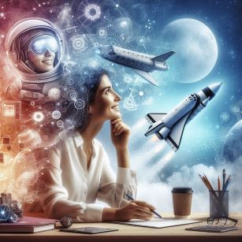

# NO MUNDO DA LUA: Um novo destino para os seus planos 🌌

## 📒 Descrição
Neste e-book de 11 páginas trazemos o Espaço como um sonho agora "possível". Direto do Mundo da Lua, criamos um conteúdo leve e descontraído que convida ao leitores a se despreenderem da realidade e viajarem conosco pelo mundo da imaginação.
.

## 🤖 Tecnologias Utilizadas
- [Copilot](https://copilot.microsoft.com/onboarding) para roteirização e criação da arte visual do e-book;
- Diagramação com MS PowerPoint.

## 🧐 Processo de Criação
Utilizei o "Copilot" para me auxiliar na criação do conteúdo e estrturá-lo, para refinar minhas ideias e para gerar imagens exclusivas para o nosso e-book. 

## 🚀 Resultados
O e-book apresenta um conteúdo inusitado e visualmente rico. No formato de "propaganda" convida leitores a se permitirem embarcar no mundo da imaginação.

<a href="output/EBOOK MUNDO DA LUA.pdf" title="View PDF now"> 📕Clique aqui para ler</a>

## 💭 Reflexão
Criar este e-book foi uma experiência enriquecedora e descontraída, um exercício prazeroso com a ajuda das IAs generativas.

## 👨‍💻 Expert

    
    
&nbsp&nbsp&nbspThaize Campos 
    &nbsp&nbsp&nbsp
    <a href="https://github.com/Thaizebmc/">
    GitHub</a>&nbsp;|&nbsp;
    <a href="https://www.linkedin.com/in/thaize-barbosa-mendes-campos-63b47427a/">LinkedIn</a>
&nbsp;|&nbsp;
    <a href="https://www.instagram.com/camposthaize/">
    Instagram</a>
&nbsp;|&nbsp;

  

---

⌨️ com 💜 por [Thaize Campos](https://github.com/Thaizebmc/)
